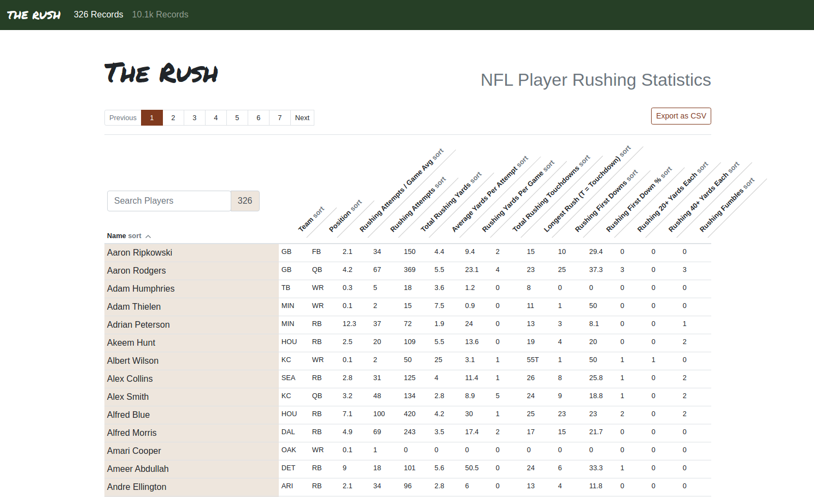

[](https://github.com/alanvardy/the_rush) 
[](https://github.com/alanvardy/the_rush) 
[](https://github.com/alanvardy/the_rush) 

# The Rush

Search and sort your favourite NFL players



## Installation and running this solution

To run this project locally:

  * Install Erlang > 22 and Elixir > 1.10 (if you use asdf you can just type `asdf install`)
  * Install dependencies with `mix deps.get`
  * Install Node.js dependencies with `npm install --prefix assets`
  * Start Phoenix endpoint with `mix phx.server`

Now you can visit [`localhost:4000`](http://localhost:4000) from your browser.

## Run the test suite

This project has a comprehensive test suite! To run the tests after installation simply execute:

```
mix check
```

... in your terminal of choice.
